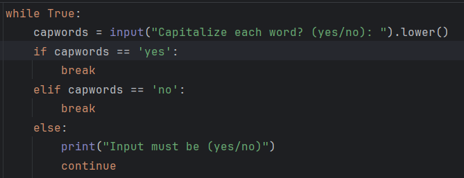
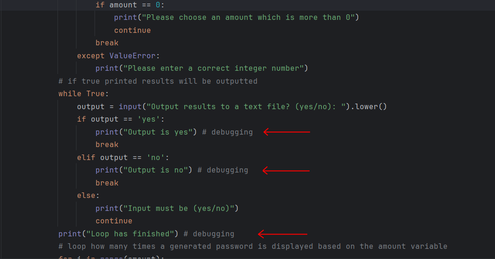

# Executive Summary

This report serves as our documentation of our software project. The report contains all the information consists of our project overview, the team behind the project and the process of our project. In the project overview we have the information about the introduction, requirements and processes of our software project.

# Project Overview

## Introduction

The software project is a secure password generator script which was created in Python. It allows the user to generate passwords and passphrases. The program allows you to input certain criteria to add into the generated passwords/passphrase, for added complexity and strength. This software automates and provides users with randomly secure passwords/passphrase that outputs several generated passwords/passphrases onto the results on the screen for the user and optionally onto a text file to analysis. 

## Team Structure and Roles

Our team consists of two members:
 - Sebastian (13176443) - Work on python code, git / report documentation
 - Phoebe (13235673) - Work on flowchart, pseudocode, git / report documentation 
---
## Problem Analysis and Requirements

When conducting an analysis, we looked towards what can be accomplished with the specific requirements of implementing an automated solution. We are required to create this project with automation in mind, throughout the entire process of our software project.

# Design Process

## Conceptual Design

The initial ideas we have come up for the secure password generator is to have automation in mind right in the beginning. When coming up with the software to generate passwords/passphrase, we were prompted to allow the user to only input in what they needed in their generated password/passphrase. The rest of the program will handle the automation of generating a secure password/passphrase and outputting the results were needed by the user. This approach provides a simple and easy design towards good user experience provided by the software.

## Algorithm Design

Detailed presentation of the developed algorithm, including flowcharts and pseudocode. See our flowchart 


## Software Design

Our choice of programming language is python. Python is a simple to use programming language that allows for a broad amount of support and technicality. And simply python allows for creating easy automation tasks with pythons' simple syntax and collection of modules and libraries which make it very ideal for scripting repetitive tasks, and an ideal programming language. After the choice of the programming language we decided on the IDE (integrated development environment) which we will use to write the python code, we decided on 'PyCharm' as our choice of IDE to develop out software project.

# Implementation

## Code Development

[SecurePasswordGenerator](SecurePasswordGenerator.py)

## Testing and Debugging

Testing process 

To test and develop our code we used PyCharm as our IDE of choice. This environment provides code analysis, an integrated unit tester along with other tools which will help the testing process to be a success, we’ve performed tests on certain factors of the software's code. Each test was conducted differently to ensure all parts of the program work as intended when it all comes together. Our test process consisted of running the program as intentional to see if any errors pop up, after a test was successful, we will then perform another test with inputs and responses that aren’t usually valid, this will test to see how our program will respond back and if any errors appear. We will then repeat to process after every iteration of our program.

Debugging 

Throughout our implementation and development of the software project we have used PyCharm as our developing and debugging environment, to perform numerous debugging methods. The debugging methods that we’ve have used were:
```
    Running the entire program first as intended then see if the program will run into potential errors during run time 

    Performing unit testing 

    Performing print debugging 

    Performing static analysis 
````
The first method is a simple one and lets us run the program like you normally would, to test if the program was successful or no. Using this method allowed us to easily find out after or during the runtime if there was something wrong and the program will tell us that 

The second method of debugging we used was **unit testing**, in each iteration of our program we have tested individual bits and parts of our code before implementing to the main, so this means before we add a new part of code to the main program we test it in its self to ensure when that the part of the code is implemented into the main, it will work still work it intentionally should.


**(A sample of the code from the program in Pycharm, this code can be run by itself to test if the output is intended)**

The third method we used was **print debugging**, in each line of code where we want something to happen, we’ve have added print statements. By adding print statements, it will output the results or message inside that print statement if a condition has been met.


**(Snapshot of the code from the program during testing in PyCharm, with red arrows pointing at the print statements that were for testing its functionality)**

The final method we use is static analysis, before execution we inspect the code of the software to check for any logical, syntax errors, to ensure the code is correctly written.

# Collaboration and Project Management

## Meeting Notes

To view out Meeting Notes please click here: [Meeting-Notes](https://github.com/13176443/PasswordGenerator/blob/main/Minutes%20Meetings/Brainstorm-Meetings.txt)

## Project Management Tools and Techniques

The tools we used to manage our project is GitHub and OneDrive. By using GitHub we’re able to push our python code and documentation onto our repository. With a repository, we can easily push & commit any changes and modifications, as well as upload any files onto our repository at any time. Having a GitHub repository allows for a centralization and collaboration platform needed for our team. We used OneDrive for the team members to share and collaborate on writing documentation for our software project. OneDrive allows for multiple people to work on the same document in real-time. 

# Documentation

## Developer Documentation

Our developer documentation is located here: [Developer-Documentation](https://github.com/13176443/PasswordGenerator/blob/main/Developer%20Documentation.pdf)

## User Documentation

To view our User Documentation please click here: [User-Documentation](https://github.com/13176443/PasswordGenerator/blob/main/User%20Documentation.pdf)

# Reflection and Conclusion

To summaries our completion of the software project, we can say we have successfully met the objectives and requirements set out to us in creating an automated program. We have faced some challenges during the project which have been overcome. Some of these challenges relate to figuring out the structure and automation of the program. How the flow for the flowchart will look, and how the pseudocode should be set out. 

To figure out to structure the python code a lot of ideas were put on how the automation process will work, with multiple iterations had to be made. Eventually a structure for the algorithm was settled, once the ideas were put into place everything went smoothly with creating the python script. 

To figure out how to create the flowchart from our ideas, we brainstormed multiple tools that can easily create a flowchart for us, eventually we settled with tldraw, a site where you can drag and drop shapes that represent the algorithm and structure of the program, this site allowed for easily prototyping during the brainstorming phase. For the flowchart, we would figure out what boxes/shapes correspond to the process, how to understand what it means, and what to write for each decision that the flowchart was asking (etc input/output). 

To figure out the pseudocode we followed much of how the python code will be structured except that it will be a bit more English orientated and understanding how you can implement the pseudocode into actual code. For the pseudocode, we received assistance and feedback from each other on how to structure and write it out properly. 

These challenges helped us learn and develop a better understanding of how to create our ideas and decisions and put them into actual code and create the functionally and structure we have designed. We believe there may be additional room for improvement in our script for future improvement, such as moving the script to be more object oriented, however this can be left for future development

# Appendices

Link to our GitHub Repository: https://github.com/13176443/PasswordGenerator

Utilised flow charts pdf from session 1, exercise 1 in the Gordon online automate processes unit. 
